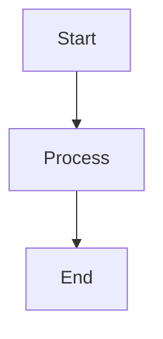

# Thrive Documentation# THRIVE Documentation


This directory contains the VitePress documentation site for Thrive.Welcome to the THRIVE project documentation! This folder contains all the planning, setup, and development documentation.


## 🚀 Quick Start## 📚 Documentation Index


```bash### Getting Started

# Install dependencies (if not already installed)- **[QUICKSTART.md](./QUICKSTART.md)** - Step-by-step guide to get started immediately

bun install  - Installation instructions

  - Phase 1 setup guide

# Start development server  - Common commands reference

bun run docs:dev  - Troubleshooting tips


# Build for production- **[SCRIPTS.md](./SCRIPTS.md)** - Available npm/bun scripts reference

bun run docs:build  - Current working scripts

  - Future scripts (by phase)

# Preview production build  - Script usage examples

bun run docs:preview  - Development workflow

```

### Planning & Roadmap

## 📁 Structure- **[PROJECT_PLAN.md](./PROJECT_PLAN.md)** - Complete 13-phase development roadmap

  - Detailed feature breakdown

```  - Phase-by-phase task lists

docs/  - Data model specifications

├── .vitepress/  - Technical architecture decisions

│   ├── config.mts          # VitePress configuration

│   ├── cache/              # Build cache (gitignored)### Development Tracking

│   └── dist/               # Built site (gitignored)- **[DEV_SUMMARY.md](./DEV_SUMMARY.md)** - Current development status and progress

├── public/                 # Static assets  - What's been completed

├── getting-started/        # Getting started guides  - Current phase status

├── user-guide/             # User documentation  - Next steps

├── developer-guide/        # Developer documentation  - Decision log

├── api-reference/          # API reference  - Known issues

├── deployment/             # Deployment guides

├── testing/                # Testing documentation- **[SETUP_CHECKLIST.md](./SETUP_CHECKLIST.md)** - Phase 0 setup completion checklist

├── troubleshooting/        # Troubleshooting guides  - Detailed setup verification

├── development-history/    # Project history  - Configuration checks

└── index.md                # Homepage  - Troubleshooting guide

```

## 🗂️ Quick Navigation

## 🌐 Deployment

### I want to...

The documentation is automatically deployed to GitHub Pages at:

**https://adriandarian.github.io/thrive/docs/**- **Start developing right now** → Read [QUICKSTART.md](./QUICKSTART.md)

- **Understand the full project scope** → Read [PROJECT_PLAN.md](./PROJECT_PLAN.md)

### Deployment Process- **Check current progress** → Read [DEV_SUMMARY.md](./DEV_SUMMARY.md)

- **See the main README** → Go to [../README.md](../README.md)

1. Push to `main` branch

2. GitHub Actions builds both the app and docs## 📋 Current Status

3. Docs are copied to `dist/docs/`

4. Everything is deployed to GitHub Pages**Phase**: 0 (Setup) - ✅ Complete  

**Next Phase**: 1 (Core UI Foundation)  

## 🎨 Features**Last Updated**: October 17, 2025


- **Search**: Full-text search powered by local search## 🔗 External Resources

- **Dark Mode**: Beautiful light and dark themes

- **Mermaid Diagrams**: Support for flowcharts and diagrams- [React 19 Documentation](https://react.dev/)

- **Syntax Highlighting**: Code blocks with line numbers- [TypeScript Handbook](https://www.typescriptlang.org/docs/)

- **Responsive**: Works on all devices- [Vite Documentation](https://vitejs.dev/)

- **Fast**: Built with Vite for lightning-fast builds- [shadcn/ui Components](https://ui.shadcn.com/)

- [TanStack Documentation](https://tanstack.com/)

## 📝 Writing Documentation- [Biome Documentation](https://biomejs.dev/)

- [Bun Documentation](https://bun.sh/docs)

All documentation is written in Markdown with VitePress extensions.

## 📝 Document Maintenance

### Frontmatter Example

When updating documentation:

```yaml1. Keep the status current in DEV_SUMMARY.md

---2. Update phase checklists in PROJECT_PLAN.md as tasks are completed

title: Page Title3. Add new decisions to the Decision Log in DEV_SUMMARY.md

description: Page description4. Update this README when adding new documentation files

---

```---


### Special ContainersHappy coding! 🚀


```markdown
::: tip
This is a tip
:::

::: warning
This is a warning
:::

::: danger
This is a danger warning
:::

::: details Click to see details
Hidden content here
:::
```

### Code Blocks

````markdown
```typescript
// TypeScript code with syntax highlighting
function hello(name: string) {
  console.log(`Hello, ${name}!`);
}
```
````

### Mermaid Diagrams

````markdown

````

## 🔧 Configuration

VitePress configuration is in `.vitepress/config.mts`.

Key configurations:
- `base`: Set to `/thrive/docs/` for GitHub Pages
- `title`: Site title
- `description`: Site description
- `themeConfig`: Sidebar, navbar, social links
- `markdown`: Markdown enhancements

## 📦 Plugins

Current plugins:
- **vitepress-plugin-mermaid**: Mermaid diagram support
- **@nolebase/vitepress-plugin-enhanced-readabilities**: Enhanced reading experience
- **markdown-it-mathjax3**: Math equation support

## 🔗 Links

- [VitePress Documentation](https://vitepress.dev/)
- [Markdown Guide](https://vitepress.dev/guide/markdown)
- [Theme Config](https://vitepress.dev/reference/default-theme-config)
- [Live Documentation](https://adriandarian.github.io/thrive/docs/)

## 🐛 Issues

If you encounter issues with the documentation:

1. Check the [VitePress docs](https://vitepress.dev/)
2. Clear the cache: `rm -rf docs/.vitepress/cache`
3. Rebuild: `bun run docs:build`
4. Open an issue on GitHub

---

**Built with ❤️ using VitePress**
